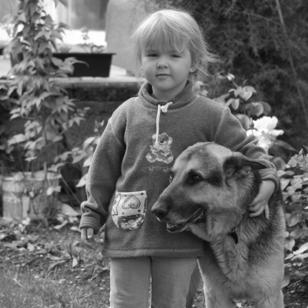
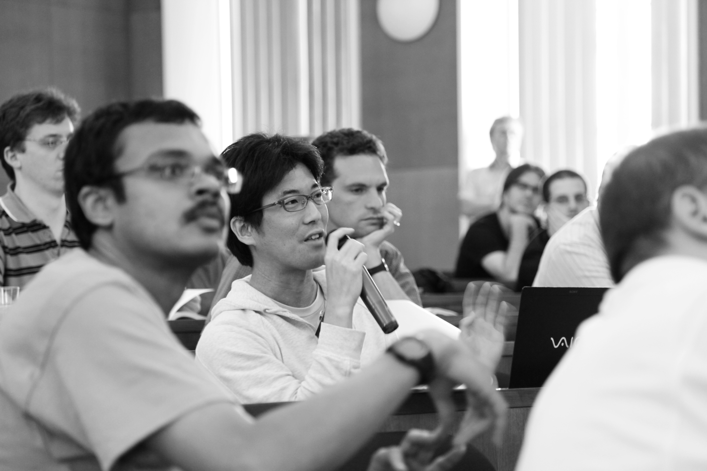
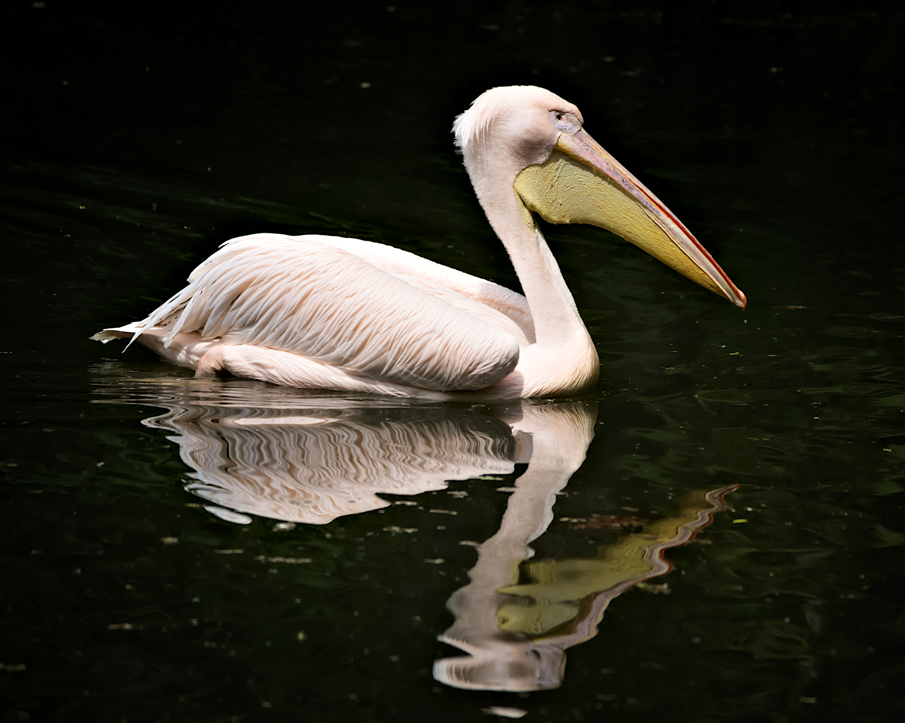

# Task 03-SFC
Your task is to implement several **Space Filling Curves** (2D pixel orderings)
and find one with the best locality preserving condition.

Locality preserving is evaluated by predictive image compression.
The best ordering gives us the least entropy when plugged into the simple
First-Order Predictive Compression scheme.

# First-Order Predictive Compression
The simplest predictive compression used in contexts where low memory footprint and
very fast computation is required. Another condition is that the data is in 1D (sequence) form,
so 2D images must be linearized by some "pixel ordering" method.

The method involves predicting the value of a given sample based on the value of the previous sample
("first-order"), and then encoding the difference between the predicted value and the actual value.
This technique can significantly reduce the amount of data to be stored or transmitted
when the input data is highly correlated (i.e., neighboring samples have similar values).

General steps in First-Order Predictive Compression:

### 1. Prediction
**Prediction Method**: Predict the next value in the data stream based on the previous value(s).
In the case of 1-order prediction, only the immediately preceding value is used for prediction.

### 2. Calculate the difference
**Difference**: Calculate the difference between the actual value and the predicted value.
This difference is often referred to as the "residual" or "error."

### 3. Encoding
**Quantization (optional)**: Sometimes, the residual is quantized to further compress
the data, especially in lossy compression. We don't need quantization, because there are only
number of possible residuals: `-255` to `255`.

**Entropy Encoding**: Encode the residuals using an entropy encoding method such as Huffman coding,
Run-Length Encoding, or Arithmetic coding to efficiently compress the data. Our task is to find
good pixel orders, so - instead of the actual encoding - we only measure the theoretical
**entropy**.

### Second-Order Predictor
Going one step further, we can use another of the **previously processed samples**.
The most popular predictor is **s'(i) = 2s(i-1) - s(i-2)** (i. e. the **linear predictor**).
The residuals are in the range `-510` to `510`.
If you are interested, you can implement this alternative in addition to the previous one,
using `-p 2` instead of the default `-p 1`.

# Task
You already have a C# "command line" project that loads the input raster image and scans its
pixels.

The pilot implementation uses only normal **line-by-line scanning ("scanline order")**.
The pixels are then sent to a simulated predictive codec, where a first-order prediction is
implemented, and then the total entropy of the entire sequence is measured.
The goal is to find a pixel order that yields the lowest entropy for the widest class
of input data.

The pilot implementation uses only the **luminance channel (grayscale)** and converts an
input image to grayscale if it is colored. You should include options to analyze the
R, G, or B color channels separately.

The **`interface IPixelOrder`** is used to traverse the pixels of a 2D raster image. A single class,
`class ScanLine`, implementing this interface is available in the pilot. Your task will be
to program as many (reasonable) alternatives as possible and test them on real data.
You can preferably use an AI assistant to find these alternatives and even have the
C# code generated.

Your main program should be able to easily switch between all the alternatives you have
implemented. Use line arguments and describe these alternatives well in the documentation.

However, you must also use the uniform format of specifying the method with a single
numeric parameter `-m <number>`, where the output is just a number expressing the
entropy in bits. Leave the pilot pixel order as `-m 0` and number your methods from one.
If your program gets a number greater than what is implemented, just return a line with
no number (like "Invalid method."). Select **the best method** and let the user to use it
simply by `-m -1`.

The command line argument defining the input file should remain `-i <filename>`. So the
example of the default scanline order used on input file `masa512g.png` is:
```bash
> 03-sfc.exe -i masa512g.png -m 0
1344753
```

If you do an **efficiency analysis** on a set of input images (you'll find some at the bottom
of this page), we'll be happy and you'll get extra points.
However, you must present the results in a clear form (spreadsheet or graphs) and preferably
include your notes and observations.

## Interface `IPixelOrder`
Abstract API of the pixel ordering methods.

```csharp
public interface IPixelOrder
{
  /// <summary>
  /// Passes all pixels from the rectangle [0,0]-[width-1,height-1]
  /// </summary>
  /// <param name="width">Rectangle width.</param>
  /// <param name="height">Rectangle height.</param>
  void Pass(int width, int height);
}
```
## Support class `DefaultPixelOrder`
This class was created for your convenience: when you inherit from it,
all you need to do is declare a trivial constructor that passes the
`PixelAction = Action<int, int>` to the base class. And of course
you have to implement the `Pass(int width, int height)` function.

```csharp
public abstract class DefaultPixelOrder : IPixelOrder
{
  /// <summary>
  /// Function called for every pixel.
  /// </summary>
  protected PixelAction Callback;

  /// <summary>
  /// Constructors will be used for callback function definitions.
  /// </summary>
  /// <param name="callback">Callback function.</param>
  protected DefaultPixelOrder(PixelAction callback) => Callback = callback;

  ...
}
```

## Error messages
The main program checks many things, you will get error message if
* the required input file doesn't exist
* the image is adressed outside of the `[0,0]-[width-1,height-1]` range
* some pixel is processed for the second time during the `Pass()`
* some pixels were omitted in the `Pass()`

# Command line arguments
Mandatory arguments:
* `-i <filename>` - **input image file**
* `-m <method>` - **pixel order method**, `0` is for default scanline order, use **positive
  integers** for your methods. Your favorite method should be encoded as `-m -1`
* `-p <order>` - **order of the predictor**. Default is `1`, you don't need to change that,
  unless you are experimenting with higher predictors. You must accept the argument anyway.

Optional arguments:
* human-readable alternative of the `-m` option
* **color channel selector** - if present, the analysis will be applied to the selected channel
  (R, G, or B) only. If not present (**=default**), image pixels are converted to grayscale
  before processing.
* any reasonable argument you will need - don't forget to describe it in the documentation.

# Output
If everything is ok, you should write the **entropy in bits** as the first output line
of `stdout` (yes, just one decimal integer). In case of an unknown method (`-m`), do
not write a number, use an error message instead.

On the next lines of the output you can write any useful information, e.g. ordering
method used, color channels analyzed, image size in pixels, entropy per pixel,
predictor order, etc.

# Launch date
**Monday 23 October 2023**
(Don't work on the solution before this date)

# Deadline
See the shared [point table](https://docs.google.com/spreadsheets/d/1QLukOcSRPa5exOYW1eUfQWY2WoMjo1menbjQIU7Gvs4/edit?usp=sharing).

# Credit points
**Basic solution: 8 points**
* must not crash under any circumstances
* must use the `interface IPixelOrder` and the `-i`, `-m` and `-p` arguments described earlier
* at least four additional pixel orderings
* measure their efficiency and select your favorite method as `-m -1`

**Bonus points: up to 7 more points**
* more pixel orderings
* separate R, G, B channel processing (one color channel at a time)
* spreadsheet or graph-based efficiency analysis; interesting observations pointed out
  in the report are appreciated.
* experiments with different predictor orders (0 is trivial, second-order predictor might be
  interesting)

## Use of AI assistant
Using an AI assistant is recommended! But you have to be critical and
test all its suggestions thoroughly. Especially test singular cases (one
pixel image, 1xN image, etc.).

## Input Images

  
  
  
  
  
  
  
