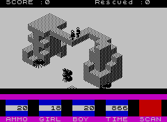
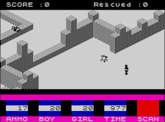
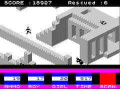

# Task 09-AntAttack
Your task is to implement a simple 3D cubic world rendering system resembling the old ZX Spectrum
game [Ant Attack](https://en.wikipedia.org/wiki/Ant_Attack) by Sandy White, Quicksilva.

  

(If you are interested in ancient game development technologies,
go to [this page](http://sandywhite.co.uk/fun/ants/))

The entire 3D scene ("the city") must be rendered interactively using the
[OpenGL library](https://www.opengl.org/) bound to the .NET through the
[Silk.NET library](https://github.com/dotnet/Silk.NET).

No need to use the original **isometric viewing system** (but the use of orthographic
projection is required). You need to keep the 3D scene made of **"axis-aligned" cubes**.

# Details
* Don't use any advanced shading, just assign **five colors/shades** to the
  five face orientations, plus one for the horizontal ground.
* Use the **orthographic view**, please.
* Use the mouse or keyboard to **rotate the view** around the vertical axis
  (you can use continuous rotation, not just four basic view directions like
  the original game)
* You can allow the **elevation angle** of the view to be set.
* Use **keyboard (WASD or arrows)** for moving your character through the city.
  Keep restricted directions of movement (north, west, south, east). 
* Allow your character to **jump** onto obstacles **one unit high** (no more).
  When jumping down, you can choose to either allow a jump from any height
  or penalize falls from higher heights.

## Game logic & bonuses
For bonus points you can implement some logic inspired by the original game:
* Control your character (boy or girl) and let him*her **find the other (lost)
  character** (girl or boy). No enemies (*level 1*).
* No **advanced rendering** of the characters is necessary. Think of a simple
  way to render a male and a female character.
* Implement simple and stupid **enemies** that will hurt you as soon as they get
  close. You can give them the ability to run as fast as you, or they can run
  a little faster. Again, don't worry about their appearance if you don't
  want to (*level 2*)
* **Time and health counters** (think about what reduces a character's health).
* It would probably be fair if you had some **defenses against the enemies**, e.g.
  throwing "grenades" from the original game seems like a good idea. Beware
  of the grenades - they can also hurt your characters! (*level 3*)
* **Micro-animations** for character movements (forward step, jump, fall),
  enemies (running, hurting your characters...), grenades (throwing, blowing up)...
* **Design interesting "cities"** from cubes. You can use the original idea -
  to encode occupied cubes by bits (the original city was no more than eight
  stories high, so one byte was used for one square of the floor plan. We can
  use 32-bit words today, which is our recommendation).
* You can try to design and implement some **different game logic**, e.g.
  discover hidden treasures, find the exit from the maze, etc.

# Sil.NET framework
It is easy to use the [Silk.NET](https://github.com/dotnet/Silk.NET) in your C#
program, you just install the [Silk.NET NuGet package](https://www.nuget.org/packages/Silk.NET/).

You can view our sample projects in the
[Silk3D directory](../Silk3D/README.md) of our repository.

# Your solution
Please place your solution in a separate [solutions](solutions/README.md)
directory in the repository. You'll find short instructions there.

# Launch date
**Monday 18 December 2023**
(Don't work on the solution before this date)

# Deadline
See the shared [point table](https://docs.google.com/spreadsheets/d/1QLukOcSRPa5exOYW1eUfQWY2WoMjo1menbjQIU7Gvs4/edit?usp=sharing).

# Credit points
**Basic solution: 10 points**
* Rendering of the "city made of cubes" in **orthographic view**.
* **Rotation of the view** around a vertical axis.
* Simple character able to move in **four directions (WASD)** and jump onto
  **one unit high obstacles**.

**Bonus points: up to 18+ more points**
* Representation of the city using **bits in vertically oriented words**. You will need
  to generate 3D world from these numbers.
* **Enemies** (dumb or smarter ones).
* **Game logic** (male/female character, looking for another character to
  rescue her/him).
* More **advanced rendering** of the characters and enemies.
* Some **defenses** against the enemies (e.g. grenades)
* **Micro-animations** of the characters/enemies/grenades...
* **Tools for "city designers"**: at least lines/planes, walls, staircase
  generators, etc. (no need to create an interactive application, procedural
  tools with some scripting capabilities will suffice)
* Set of more advanced **city maps** ready to be used in the game.
* Different **game logic**: treasure hunt, escape from the maze...

## Use of AI assistant
It is possible to use an AI assistant, but you have to be critical and
test all its suggestions thoroughly.
